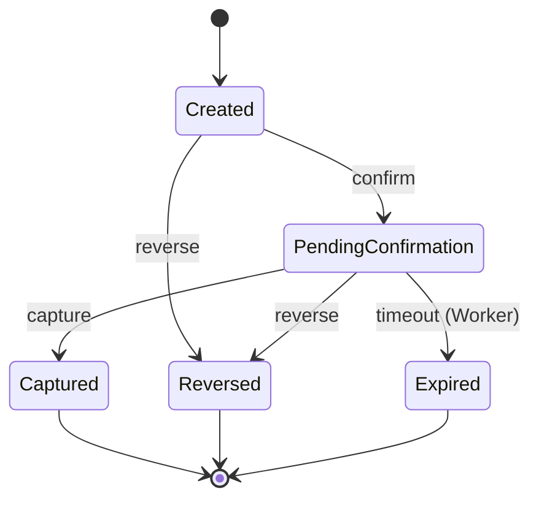

# Payment Intent POC

Sistema de backend para gestión de Payment Intents con estados, expiración automática, reversa manual y arquitectura desacoplada.

## 🏗️ Arquitectura

```
┌─────────────────────────────────────────────┐
│           Payments.Shared                   │
│        (Modelos, DTOs, Enums)              │
└─────────────────┬───────────────────────────┘
                  │
                  ↓
┌─────────────────────────────────────────────┐
│       Payments.Application                  │
│   - PaymentsDbContext (EF Core)            │
│   - IPaymentIntentService                  │
│   - PaymentIntentService                   │
│   - Lógica de negocio                      │
└─────────────┬───────────────┬───────────────┘
              │               │
         ┌────↓────┐    ┌────↓────┐
         │   API   │    │ Worker  │
         │(HTTP)   │    │(Background)
         └─────────┘    └─────────┘
```

### Separación de responsabilidades:
- **Shared**: Contratos y modelos compartidos
- **Application**: Lógica de negocio y acceso a datos
- **API**: Endpoints HTTP y controllers
- **Worker**: Procesos en background (expiración)

## 📁 Estructura del proyecto

```
poc-payments/
├── docs/
│   ├── fase0-design.md              # Diseño inicial
│   ├── fase1b-closure.md            # Validación y cierre Fase 1B
│   ├── database-setup.md            # Setup de DB
│   └── domain-improvements.md       # Mejoras de dominio
├── src/
│   ├── Payments.Shared/             # Modelos y DTOs
│   ├── Payments.Application/        # ⭐ Lógica de negocio
│   │   ├── Data/
│   │   │   └── PaymentsDbContext.cs
│   │   └── Services/
│   │       ├── IPaymentIntentService.cs
│   │       └── PaymentIntentService.cs
│   ├── Payments.Api/                # API REST (.NET 8)
│   └── Payments.Worker/             # Worker de expiración
├── infra/
│   └── docker-compose.yml           # Postgres + Redis
├── migrate-phase1b.bat              # ⭐ Migración limpia
└── README.md
```

## ⚡ Inicio rápido

### 1. Levantar infraestructura

```bash
cd infra
docker compose up -d
```

Esto levanta:
- **Postgres** en `localhost:5432`
- **Redis** en `localhost:6379`

### 2. Aplicar migración de base de datos

```bash
cd C:\DesarrolloC#\poc-payments
migrate-phase1b.bat
```

Esto crea la tabla `payment_intents` con todos los campos y índices necesarios.

### 3. Ejecutar la API

```bash
cd src/Payments.Api
dotnet restore
dotnet run
```

La API estará disponible en:
- **HTTP**: http://localhost:5000
- **Swagger**: http://localhost:5000/swagger

### 4. Ejecutar el Worker (otra terminal)

```bash
cd src/Payments.Worker
dotnet restore
dotnet run
```

El worker ejecuta cada 30 segundos y expira intents automáticamente.

## 🔗 Endpoints disponibles

### Health Check
```bash
GET /api/health
```

### Payment Intents

**Crear intent:**
```bash
POST /api/payment-intents
Content-Type: application/json

{
  "amount": 10000,
  "currency": "ARS",
  "description": "Pago de prueba"
}

Response: 201 Created
{
  "id": "pi_...",
  "status": "Created",
  ...
}
```

**Consultar intent:**
```bash
GET /api/payment-intents/{id}

Response: 200 OK
```

**Confirmar intent:**
```bash
POST /api/payment-intents/{id}/confirm

Response: 200 OK
{
  "status": "PendingConfirmation",
  "confirmedAt": "2025-12-22T...",
  "expiresAt": "2025-12-22T..." (confirmedAt + 120s)
}
```

**Capturar intent:**
```bash
POST /api/payment-intents/{id}/capture

Response: 200 OK (o 409 Conflict si estado inválido)
```

**Revertir intent:**
```bash
POST /api/payment-intents/{id}/reverse

Response: 200 OK (o 409 Conflict si estado inválido)
```

## 🔄 Flujo de estados



### Reglas de transición:
- `Created` → `PendingConfirmation` (confirm)
- `PendingConfirmation` → `Captured` (capture)
- `Created` / `PendingConfirmation` → `Reversed` (reverse)
- `PendingConfirmation` → `Expired` (Worker, después de 120s)

### Estados finales:
- `Captured`, `Reversed`, `Expired` (no permiten más transiciones)

## ⚙️ Configuración

Los parámetros están en `appsettings.json`:

```json
{
  "ConnectionStrings": {
    "PostgresConnection": "Host=localhost;Port=5432;Database=payments_db;Username=postgres;Password=postgres123",
    "RedisConnection": "localhost:6379"
  },
  "PaymentSettings": {
    "ExpirationTimeoutSeconds": 120,
    "WorkerIntervalSeconds": 30
  }
}
```

## 📊 Estado actual

### ✅ Fase 1B - Completada
- ✅ Arquitectura desacoplada (Application layer)
- ✅ Persistencia en Postgres con EF Core
- ✅ Validación de transiciones de estado
- ✅ Expiración automática funcional (Worker)
- ✅ HTTP status codes correctos (409 Conflict)
- ✅ Limpieza de dominio (ExpiresAt)
- ✅ Mapeo EF Core a snake_case
- ✅ Índices optimizados en DB

### ⏳ Próximas fases
- **Fase 2**: Idempotencia con Redis
- **Fase 3**: Outbox pattern + eventos
- **Fase 4**: Observabilidad (CorrelationId, métricas)
- **Fase 5**: Frontend intercambiable (Next.js / React)

## 🧪 Validación funcional

Ver documento completo: `docs/fase1b-closure.md`

### Test rápido:
1. Crear intent → Confirmar → Esperar 2+ min → Verifica que expira
2. Crear intent → Confirmar → Capturar (< 2 min) → Verifica que NO expira
3. Intentar capturar sin confirmar → Verifica 409 Conflict

## 🐛 Troubleshooting

**Error al ejecutar migraciones:**
```bash
# Asegúrate de tener dotnet-ef
dotnet tool install --global dotnet-ef

# Ejecuta desde el proyecto API
cd src/Payments.Api
dotnet ef database update
```

**Worker no expira intents:**
```bash
# Verifica que el Worker esté corriendo
# Verifica que la configuración sea correcta (120s timeout)
# Chequea los logs cada 30 segundos
```

**409 Conflict no aparece:**
```bash
# Verifica que la API esté usando Payments.Application
# Verifica que los controllers usen Conflict() no BadRequest()
```

## 🔍 Verificación de DB

Conectarse a Postgres:
```bash
docker exec -it payments-postgres psql -U postgres -d payments_db

# Ver estructura
\d payment_intents

# Ver índices
\di

# Consultar datos
SELECT * FROM payment_intents ORDER BY created_at DESC LIMIT 10;
```

## 📚 Documentación adicional

- [Diseño Fase 0](docs/fase0-design.md) - Arquitectura y decisiones
- [Cierre Fase 1B](docs/fase1b-closure.md) - Validación completa
- [Setup DB](docs/database-setup.md) - Configuración de base de datos
- [Mejoras de Dominio](docs/domain-improvements.md) - Changelog de mejoras

## 🎯 Comandos útiles

```bash
# Levantar todo
cd infra && docker compose up -d
cd ../src/Payments.Api && dotnet run
cd ../Payments.Worker && dotnet run  # otra terminal

# Resetear DB
cd src/Payments.Api
dotnet ef database drop --force
dotnet ef database update

# Ver logs de Docker
docker logs payments-postgres
docker logs payments-redis

# Detener todo
docker compose down
```

## 📝 Notas de arquitectura

### ¿Por qué Application layer?
- **Desacoplamiento**: API y Worker comparten lógica sin acoplarse
- **Testability**: Lógica de negocio testeable sin HTTP
- **Reusabilidad**: Otros consumers (CLI, otro Worker) pueden usar la misma lógica
- **Separation of Concerns**: HTTP != Background != Business Logic

### Principios aplicados:
- Clean Architecture (capas bien definidas)
- Dependency Inversion (depender de abstracciones)
- Single Responsibility (cada proyecto tiene un propósito claro)
- Domain-Driven Design (validaciones en el servicio, no en controllers)

---

**Requisitos:**
- .NET 8 SDK
- Docker Desktop
- dotnet-ef tool (`dotnet tool install --global dotnet-ef`)

**Licencia:** MIT
