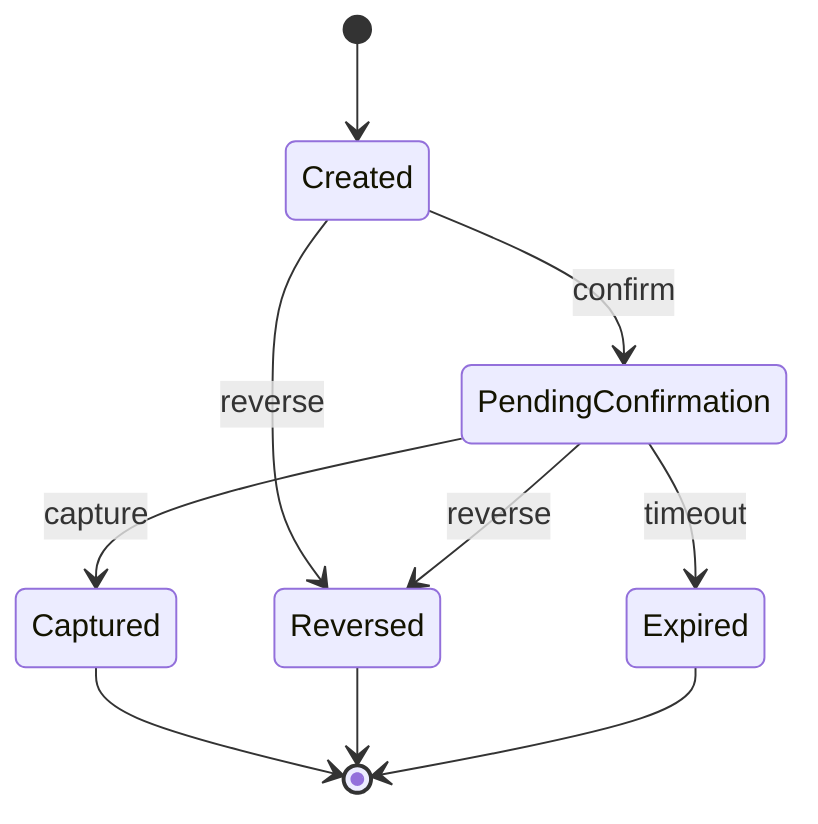

# Fase 0 — Diseño (Payment Intent POC)

## Objetivo

Construir un backend reusable (API + Worker) que modele un flujo tipo Payment Intent con estados, expiración automática, reversa manual e idempotencia; y permitir múltiples frontends (Next.js SSR / SPA) consumiendo el mismo backend.

---

## Estados y transiciones

### Estados

- **Created** - Intent creado, esperando confirmación
- **PendingConfirmation** - Confirmado, esperando captura
- **Captured** *(final)* - Transacción capturada exitosamente
- **Reversed** *(final)* - Revertido manualmente
- **Expired** *(final)* - Expirado por timeout

### Transiciones permitidas

| Desde | Acción | Hacia |
|-------|--------|-------|
| `Created` | `confirm` | `PendingConfirmation` |
| `PendingConfirmation` | `capture` | `Captured` |
| `Created` | `reverse` | `Reversed` |
| `PendingConfirmation` | `reverse` | `Reversed` |
| `PendingConfirmation` | *timeout automático* | `Expired` |

### Notas

- **Expired** es un cierre por timeout (no se puede "revertir" después en esta fase)
- **Refund** post-capture queda fuera del alcance (sería otro estado/flujo)
- Estados finales no permiten más transiciones

### Diagrama (Mermaid)



---

## Contrato API (v1)

**Base URL:** `/api`

### Endpoints

#### `POST /payment-intents`
Crea un payment intent.

**Request:**
```json
{
  "amount": 10000,
  "currency": "ARS",
  "description": "Pago demo"
}
```

**Response (201):**
```json
{
  "id": "pi_abc123",
  "status": "Created",
  "amount": 10000,
  "currency": "ARS",
  "createdAt": "2025-12-22T10:30:00Z"
}
```

**Headers futuros:**
- `Idempotency-Key` (fase 3)

---

#### `GET /payment-intents/{id}`
Consulta el estado actual de un intent.

**Response (200):**
```json
{
  "id": "pi_abc123",
  "status": "PendingConfirmation",
  "amount": 10000,
  "currency": "ARS",
  "createdAt": "2025-12-22T10:30:00Z",
  "updatedAt": "2025-12-22T10:31:00Z"
}
```

---

#### `POST /payment-intents/{id}/confirm`
Confirma el intent (transición: `Created` → `PendingConfirmation`).

**Response (200):**
```json
{
  "id": "pi_abc123",
  "status": "PendingConfirmation",
  "confirmedAt": "2025-12-22T10:31:00Z"
}
```

**Errores:**
- `400` - Estado inválido para confirmar
- `404` - Intent no encontrado

---

#### `POST /payment-intents/{id}/capture`
Captura el intent (transición: `PendingConfirmation` → `Captured`).

**Response (200):**
```json
{
  "id": "pi_abc123",
  "status": "Captured",
  "capturedAt": "2025-12-22T10:32:00Z"
}
```

**Errores:**
- `400` - Estado inválido para capturar
- `404` - Intent no encontrado

---

#### `POST /payment-intents/{id}/reverse`
Reversa manual del intent (transición: `Created|PendingConfirmation` → `Reversed`).

**Response (200):**
```json
{
  "id": "pi_abc123",
  "status": "Reversed",
  "reversedAt": "2025-12-22T10:32:00Z"
}
```

**Errores:**
- `400` - Estado inválido para revertir (ya está en estado final)
- `404` - Intent no encontrado

---

## Arquitectura de componentes

### Componentes principales

#### 1. API .NET
- Expone endpoints HTTP (ASP.NET Core Web API)
- Valida transiciones de estado
- Persiste en base de datos
- Emite eventos a Outbox (fase posterior)
- Maneja idempotencia (fase 3)

#### 2. Postgres
- Persistencia principal
  - Tabla `payment_intents`
  - *(fase posterior)* `outbox_events`
  - *(fase posterior)* `idempotency_records`

#### 3. Redis
- Idempotency keys + locks distribuidos (fase 3)
- Caching opcional de consultas frecuentes

#### 4. Worker (Background Service)
- Expira intents en `PendingConfirmation` que superen el timeout
- *(fase posterior)* Procesa retry de eventos
- *(fase posterior)* Publica eventos desde Outbox

#### 5. Orquestación
- `docker-compose.yml` levanta todo el stack local
- Redes y volúmenes para persistencia

### Diagrama de componentes

```
┌─────────────┐
│   Client    │
└──────┬──────┘
       │ HTTP
       ▼
┌─────────────┐      ┌──────────┐
│  API .NET   │◄────►│  Redis   │
└──────┬──────┘      └──────────┘
       │
       ▼
┌─────────────┐
│  Postgres   │
└──────┬──────┘
       ▲
       │
┌──────┴──────┐
│   Worker    │
└─────────────┘
```

---

## Parámetros de configuración

| Parámetro | Valor (demo) | Descripción |
|-----------|--------------|-------------|
| `ExpirationTimeoutSeconds` | `120` | Tiempo antes de expirar un intent en `PendingConfirmation` |
| `WorkerIntervalSeconds` | `30` | Intervalo de ejecución del worker de expiración |

---

## Decisiones técnicas

| Aspecto | Decisión | Justificación |
|---------|----------|---------------|
| Base de datos | Postgres | Más liviano en Docker, excelente soporte en .NET |
| Cache | Redis | Estándar de facto para idempotencia y locks |
| Stack API | .NET 8 (o superior) | Maduro, performante, buen ecosistema |
| Timeout demo | 2 minutos | Suficiente para demostrar sin esperar mucho |

---

## Entregables de Fase 0

- ✅ Diagrama de estados con transiciones
- ✅ Contrato API (endpoints + request/response)
- ✅ Arquitectura de componentes
- ✅ Decisiones técnicas documentadas

**Próximo paso:** Fase 1 - Backend esqueleto (API + DB)

---

## Notas adicionales

### Validaciones de negocio (a implementar en Fase 1)

- No permitir transiciones inválidas (retornar 400 con mensaje claro)
- Verificar que `amount > 0` en creación
- *(opcional)* Validar formato de `currency` (ISO 4217)

### Observabilidad (a implementar en Fase 5)

- `X-Correlation-Id` en headers
- Logs estructurados (JSON)
- Métricas básicas por estado

### Seguridad (fuera de alcance en POC)

- Autenticación/autorización
- Rate limiting
- Encriptación de datos sensibles
